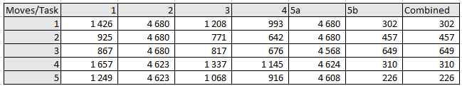
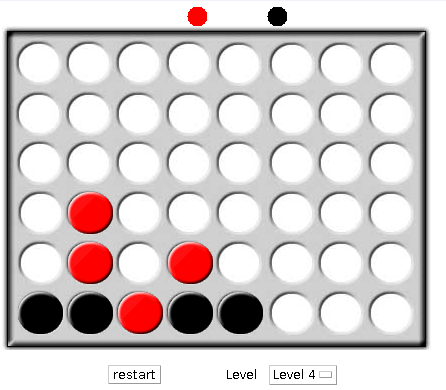
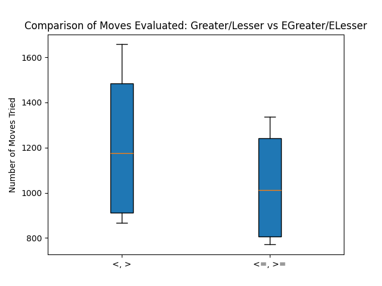
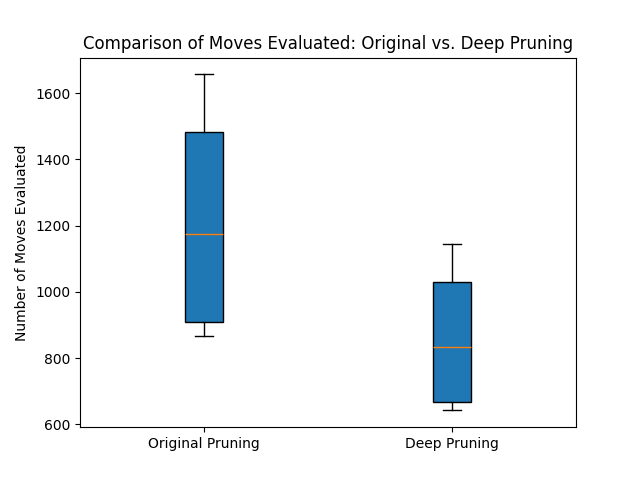
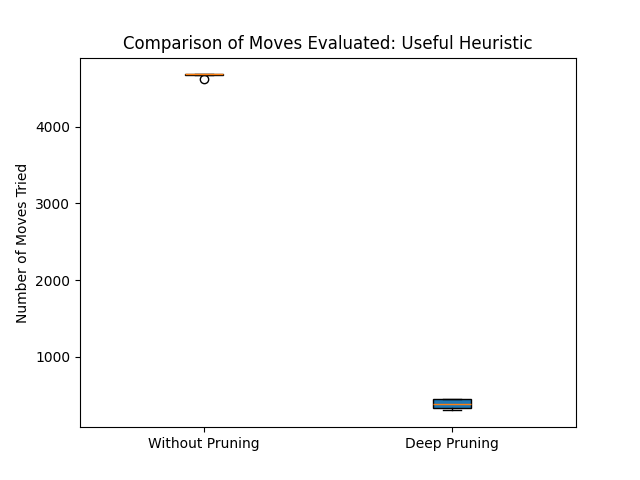

# Connect Four


## Task 1
Comparison of the moves for every stage of the repsective tasks.



## Task 2

### Disabling pruning

The alpha-beta pruning happens in `MinmaxPlayer.java` in the `expandMinNode` and `expandMaxNode` methods.

We showcase just the `expandMinNode` method since both are quite similar.

```java
// MinmaxPlayer.java
	...
  private int expandMinNode(int depth, int parentMaximum) {
    // base step
    if (depth == 0 || board.isGameOver()) {
      return board.getBoardStats().getStrength(maxPlayer);
    }

    // recursive step
    Move[] moves = board.getPossibleMoves(minPlayer);
    int minStrength = MAX_POSSIBLE_STRENGTH;

    for (int i = 0; i < moves.length; i++) {
      if (board.move(moves[i])) {
        moveCount++;
        int strength = expandMaxNode(depth - 1, minStrength);

        // ⚡ TASK 2 - PRUNING DISABLED ⚡
        // if (strength < parentMaximum) {
        // board.undoLastMove();
        // return strength;
        // }
        if (strength < minStrength) {
          minStrength = strength;
        }
        board.undoLastMove();
      } // end if move made

    } // end for all moves

    return minStrength;

  }// end expandMaxNode
```

### Number of moves

$$
number\space of\space  positions\space  evaluated\space  at\space  depth\space  d = n^d
$$

$$
evaluated\space moves = \Sigma^{d}_{i=1} C^i
$$

- $$C$$: Represents the number of columns or possible moves from any given board state, also referred to as the branching factor.
- $$d$$: The search depth, which indicates how many turns ahead the algorithm will evaluate.

This formula represents the sum of the number of possible move combinations evaluated at each depth level from $$1$$ to $$d$$. It sums up all the possibilities layer by layer, considering that at  each depth, the number of potential move combinations is the number of  possible moves to the power of the depth level.


1. **At Depth $$1$$**: The algorithm evaluates $$C$$ moves (one for each column where a piece can be dropped). This is the base case, where each possible move is an individual column selection.
2. **At Depth $$2$$**: The algorithm evaluates each of the initial $$C$$ moves and for each, considers $$C$$ subsequent responses by the opponent. This gives $$C^2$$ evaluations at this level.
3. **Continuing to Depth $$d$$**: At each subsequent depth, every possible move from the previous depth can lead to $$C$$ new possible moves, resulting in $$C^i$$ combinations at depth $$i$$.


Since no pruning happens during the first rounds, the number of evaluated moves must match this formula. 


Level 1:

> MINIMAX: Number of moves tried: 8 Time: 0 milliseconds
> MINIMAX: Number of moves tried: 8 Time: 0 milliseconds
> MINIMAX: Number of moves tried: 8 Time: 0 milliseconds
> MINIMAX: Number of moves tried: 8 Time: 0 milliseconds 

Level 4:

Runde 1

> MINIMAX: Number of moves tried: 4680 Time: 5 milliseconds
> MINIMAX: Number of moves tried: 4680 Time: 3 milliseconds
> MINIMAX: Number of moves tried: 4679 Time: 3 milliseconds
> MINIMAX: Number of moves tried: 4679 Time: 3 milliseconds

Runde 2

> MINIMAX: Number of moves tried: 4680 Time: 2 milliseconds
> MINIMAX: Number of moves tried: 4680 Time: 1 milliseconds
> MINIMAX: Number of moves tried: 4680 Time: 2 milliseconds
> MINIMAX: Number of moves tried: 4608 Time: 4 milliseconds

Level 8:

Since the computation with $$depth = n$$​ takes quite some time to compute, we assume the MinmaxPlayer is stopped by an `interrupt`. Therefore the numbers aren't the same for each starting round.

```java
// MinmaxPlayer.calculateMove(int depth)
...
for (int i = 0; i < moves.length; i++) {
  if (board.move(moves[i])) {
    moveCount++;

    int strength = expandMinNode(depth - 1, maxStrength);
    if (strength > maxStrength) {
      maxStrength = strength;
      maxIndex = i;
    }
    board.undoLastMove();
  } // end if move made

  // ⚡ INTERRUPT HERE ⚡
  // if the thread has been interrupted, return immediately.
  if (Thread.currentThread().isInterrupted()) {
    return null;
  }
} // end for all moves
```

> MINIMAX: Number of moves tried: **18875642** Time: 5678 milliseconds
> MINIMAX: Number of moves tried: **18141415** Time: 5544 milliseconds
> MINIMAX: Number of moves tried: **18859732** Time: 5522 milliseconds
> MINIMAX: Number of moves tried: **17886847** Time: 5938 milliseconds

> MINIMAX: Number of moves tried: **18724586** Time: 5315 milliseconds
> MINIMAX: Number of moves tried: **18920055** Time: 6149 milliseconds
> MINIMAX: Number of moves tried: **17961114** Time: 5795 milliseconds
> MINIMAX: Number of moves tried: **16810760** Time: 5303 milliseconds

## Task 3

To prune if the current value is equal to the pruning limit we need to change the condition when pruning happens. The snippet is located in `MinmaxPlayer`.

```java
// MinmaxPlayer.java
private int expandMaxNode(int depth, int parentMinimum) {
  ...
    // FH: change condition from > to >= to enable correct pruning 
    if (strength >= parentMinimum) {
      board.undoLastMove();
      return strength;
    }
  ...
}
```

```java
// MinmaxPlayer.java
private int expandMinNode(int depth, int parentMinimum) {
  ...
    // FH: change condition from < to <= to enable correct pruning
    if (strength <= parentMaximum) {
      board.undoLastMove();
      return strength;
    }
  ...
}
```


### Measurement

To measure the difference in performance we play 2 rounds with the original version and 2 rounds with the modified version. We always take the same moves each round. All games are played on level 4.






#### Measurement original version

##### 1 game

> MINIMAX: Number of moves tried: 1426 Time: 8 milliseconds
> MINIMAX: Number of moves tried: 925 Time: 1 milliseconds
> MINIMAX: Number of moves tried: 867 Time: 1 milliseconds
> MINIMAX: Number of moves tried: 1657 Time: 1 milliseconds

##### 2 game

> MINIMAX: Number of moves tried: 1426 Time: 1 milliseconds
> MINIMAX: Number of moves tried: 925 Time: 1 milliseconds
> MINIMAX: Number of moves tried: 867 Time: 0 milliseconds
> MINIMAX: Number of moves tried: 1657 Time: 1 milliseconds

#### Measurement modified version

#### 1 game:

> MINIMAX: Number of moves tried: 1208 Time: 4 milliseconds
> MINIMAX: Number of moves tried: 771 Time: 1 milliseconds
> MINIMAX: Number of moves tried: 817 Time: 0 milliseconds
> MINIMAX: Number of moves tried: 1337 Time: 1 milliseconds

#### 2 game:

> MINIMAX: Number of moves tried:1208 Time:2 milliseconds
> MINIMAX: Number of moves tried:771 Time:0 milliseconds
> MINIMAX: Number of moves tried:817 Time:1 milliseconds
> MINIMAX: Number of moves tried:1337 Time:0 milliseconds

## Task 4

The refactoring from the original Minimax implementation to the updated version with explicit Alpha-Beta pruning parameters (`alpha` and `beta`) involves several key modifications to enhance the algorithm's  efficiency and correctness. These changes streamline the decision-making process, reduce redundant calculations, and better adhere to the  principles of Alpha-Beta pruning.

- **Alpha (α)**: Represents the maximum lower bound of possible solutions along the path to the root for the maximizing player. It is initialized as `MIN_POSSIBLE_STRENGTH_ALPHA`.
- **Beta (β)**: Represents the minimum upper bound of possible solutions along the path to the root for the minimizing player. It is initialized as `MAX_POSSIBLE_STRENGTH_BETA`.

These parameters are passed down through the recursive calls, allowing each node to be aware of the boundaries established by its ancestors, which helps in deciding whether to prune a branch or not.

The function signatures of `expandMaxNode` and `expandMinNode` are updated to include both `alpha` and `beta` as parameters, allowing these values to dynamically adjust as the recursion unfolds deeper into potential future game states. This dynamic adjustment is pivotal in correctly implementing Alpha-Beta pruning, as it relies on updating these thresholds to reflect the best possible outcomes discovered during the search.

### Changes in Recursive Expansion Methods

- `expandMaxNode` and `expandMinNode` Changes
  - The original code used a single parameter (`maxStrength` or `minStrength`) which represented the best value found so far for max and min nodes respectively. The refactored code, however, uses both `alpha` and `beta` to keep track of the current bounds of maximally and minimally acceptable scores, allowing each node to make informed decisions about pruning.
  - In `expandMaxNode`, if the strength returned from a child node (`expandMinNode`) is greater than or equal to `beta`, the function returns immediately, because the maximizing player (parent node) will not choose a path that is worse than its current best known option (`beta`).
  - Similarly, in `expandMinNode`, if the strength returned from `expandMaxNode` is less than or equal to `alpha`, the function returns immediately for analogous reasons.

```java
// MinmaxPlayer.java
/**
   * Calculate the move to be made.
   */
public Move calculateMove(int depth) {
  ...
    for (int i = 0; i < moves.length; i++) {
      if (board.move(moves[i])) {
        moveCount++;

        // ⚡ give both parameters, alpha and beta ⚡
        int strength = expandMinNode(depth - 1, maxStrength, MAX_POSSIBLE_STRENGTH_BETA);
        if (strength > maxStrength) {
          maxStrength = strength;
          maxIndex = i;
        }
        board.undoLastMove();
      } // end if move made
      ...
    } // end for all moves
  ...
    return moves[maxIndex];
}

/**
   * A max node returns the max score of its descendents. parentMinimum is the
   * minumum score that the parent has already encountered. if we find a score
   * that is higher than this, we will return that score immediately rather than
   * continue to expand the tree, since the min node above us only cares if we are
   * lower than its current min score.
   */
private int expandMaxNode(int depth, ⚡ int alpha ⚡, ⚡ int beta ⚡) {
  ...
    // ⚡ change minStrength to beta since we get this from above the call chain ⚡
    //int maxStrength = MIN_POSSIBLE_STRENGTH_ALPHA;

    for (int i = 0; i < moves.length; i++) {
      if (board.move(moves[i])) {
        ...
          // ⚡ change condition from > to >= to enable correct pruning ⚡
          if (strength >= beta) { // beta <= v (strength)
            return strength;
          }
        if (strength > alpha) {
          alpha = strength;
        }
      } // end if move made
    } // end for all moves
  ...
    return alpha;

}// end expandMaxNode

/**
   * The min node chooses the smallest of its descendents. parentMaximum is the
   * maximum that the parent max node has already found, if we find something
   * smaller than this, return immediatly, since the parent max node will choose
   * the greatest value it can find.
   */
private int expandMinNode(int depth, ⚡ int alpha ⚡, ⚡ int beta ⚡) { 
  ...
    // ⚡ change minStrength to beta since we get this from above the call chain ⚡
    //int minStrength = MAX_POSSIBLE_STRENGTH_BETA;
    for (int i = 0; i < moves.length; i++) {
      ...
        // ⚡ change condition from < to <= to enable correct pruning ⚡
        if (strength <= alpha) { // alpha >= v ( strength )
          return strength;
        }
      // ⚡ if we encounter a new minimum in the tree descent than we have to return it as the
      // maximum possible strength of the current visisted node (since parent always minimizes) ⚡
      if (strength < beta) {
        beta = strength;
      }
    } // end if move made

} // end for all moves

return beta;

}// end expandMaxNode
```

### Measurement



The box plot above compares the number of moves evaluated by the Minimax algorithm under original and deep pruning conditions. The plot  illustrates that deep pruning generally results in fewer moves being  evaluated compared to the original pruning method. This suggests that  deep pruning is more effective in reducing the search space and  potentially speeds up the decision-making process by focusing on more  promising branches of the search tree.

1 game:

> MINIMAX: Number of moves tried: 993 Time: 3 milliseconds
> MINIMAX: Number of moves tried: 642 Time: 0 milliseconds
> MINIMAX: Number of moves tried: 676 Time: 1 milliseconds
> MINIMAX: Number of moves tried: 1145 Time: 1 milliseconds

2 game:

> MINIMAX: Number of moves tried:993 Time:1 milliseconds
> MINIMAX: Number of moves tried:642 Time:0 milliseconds
> MINIMAX: Number of moves tried:676 Time:0 milliseconds
> MINIMAX: Number of moves tried :1145 Time:1 milliseconds


## Task 5

To use the middle moves first for evaluation, we just need to adapt the constructor of the C4Board which stores all the player moves in a array. The preferred order of moves is stored in a hard coded array.

```java
// C4Board.java
public final class C4Board implements Boards {
  ...
    // hard coded, preferable ordering of moves
    // middle columns tend to be better
    private static int[] PREFERED_ORDER_OF_MOVES = {3,4,2,5,1,6,0,7};
  ...
    /** Creates new C4Board */
    public C4Board(Player firstPlayer, Player secondPlayer) {
    initSlots();

    // create the moves arrays, these are all the possible moves
    firstPlayerMoves = new Move[NUMBER_OF_COLUMNS];
    secondPlayerMoves = new Move[NUMBER_OF_COLUMNS];

    // change ordering of columns to evaluate middle moves first
    for (int i = 0; i < NUMBER_OF_COLUMNS; i++) {
      firstPlayerMoves[i] = new C4Move(firstPlayer, PREFERED_ORDER_OF_MOVES[i]);
      secondPlayerMoves[i] = new C4Move(secondPlayer, PREFERED_ORDER_OF_MOVES[i]);
    }

  }// end constructor
}
```

### Measurement



The plot  illustrates the impact of move order strategies on the number of moves  evaluated by the Minimax algorithm, comparing "Without Pruning" and "Deep Pruning"

The choice of column ordering in the evaluation of game moves  significantly impacts the performance of the Minimax algorithm. Starting from the middle columns tends to be more efficient, potentially because this approach quickly addresses more critical parts of the game board,  where decisive moves are more likely to occur. This strategy can be  particularly beneficial in games where central control is crucial to  success.

Evaluating moves beginning from the middle columns appears to be far  more efficient, as seen from the lower and tightly packed results on the plot. This suggests that starting evaluations from the center of the  board (assuming a game like Connect Four or similar) may quickly lead to finding more strategic moves, effectively reducing the search space and the total number of moves evaluated.

Without Pruning but hardcoded positions

> MINIMAX: Number of moves tried:4680 Time:4 milliseconds
>  MINIMAX: Number of moves tried:4680 Time:2 milliseconds
>  MINIMAX: Number of moves tried:4680 Time:1 milliseconds
>  MINIMAX: Number of moves tried:4623 Time:3 milliseconds

> MINIMAX: Number of moves tried:4680 Time:2 milliseconds
>  MINIMAX: Number of moves tried:4680 Time:2 milliseconds
>  MINIMAX: Number of moves tried:4680 Time:1 milliseconds
>  MINIMAX: Number of moves tried:4623 Time:1 milliseconds

> MINIMAX: Number of moves tried:4680 Time:1 milliseconds
>  MINIMAX: Number of moves tried:4680 Time:1 milliseconds
>  MINIMAX: Number of moves tried:4680 Time:1 milliseconds
>  MINIMAX: Number of moves tried:4623 Time:1 milliseconds

With deep pruning

> MINIMAX: Number of moves tried:302 Time:2 milliseconds
> MINIMAX: Number of moves tried:457 Time:1 milliseconds
> MINIMAX: Number of moves tried:440 Time:0 milliseconds
> MINIMAX: Number of moves tried:337 Time:0 milliseconds

> MINIMAX: Number of moves tried:302 Time:0 milliseconds
> MINIMAX: Number of moves tried:457 Time:1 milliseconds
> MINIMAX: Number of moves tried:440 Time:0 milliseconds
> MINIMAX: Number of moves tried:337 Time:1 milliseconds

> MINIMAX: Number of moves tried:302 Time:0 milliseconds
> MINIMAX: Number of moves tried:457 Time:1 milliseconds
> MINIMAX: Number of moves tried:440 Time:0 milliseconds
> MINIMAX: Number of moves tried:337 Time:1 milliseconds

## Task 6

The number **84** in the `C4Board.java` code likely represents the total number of potential winning combinations available on an 8-column Connect Four board. To adapt this number correctly when changing the board dimensions, we need to calculate the possible winning lines based on both the number of rows and columns.

Here’s how the number of possible win conditions can be recalculated based on `NUMBER_OF_COLUMNS` and `NUMBER_OF_ROWS`:

```java
//C4Board.java
/**
   * Create the slots and organize them into rows
   */
private void initSlots() {
  ...

  int horizontalWins = NUMBER_OF_ROWS * (NUMBER_OF_COLUMNS - 3);
  int verticalWins = NUMBER_OF_COLUMNS * (NUMBER_OF_ROWS - 3);
  // For diagonal wins we have to get all possible positions from which 
  // we can achieve a diagonal line and multiply it by 2 since we can
  // either get it right/left diagonal
  int diagonalWins = 2 * ((NUMBER_OF_COLUMNS -3) * (NUMBER_OF_ROWS-3));
  int allPossibleWins = horizontalWins + verticalWins + diagonalWins;
  rows = new Vector<C4Row>(allPossibleWins);
  // old:   rows = new Vector<C4Row>(84);

}
```

## Task 7

The heuristic calculation for determining the strength of each player's position in the game is executed in the **C4Stats.java** file. Each player has four private variables—**pi_1InARow** through **pi_4InARow**—that track the occurrences of one to four pieces in a row, respectively. 

Achieving four pieces in a row signifies a win and immediately concludes the game. The other counts (one to three in a row) are assigned increasing weights through bit shifting to reflect their strategic importance: **pi_3InARow** is given the highest weight with a bit shift of 5, equivalent to multiplying by 64, **pi_2InARow** is weighted with a bit shift of 2, which multiplies it by 4, and **pi_1InARow** does not receive any multiplier.

The respective formula is

```java
 return (p1_2InARow << SHIFT_2_IN_A_ROW) + (p1_3InARow << SHIFT_3_IN_A_ROW) + p1_1InARow;
```

 and for player 2 respectively

```java
 return (p2_2InARow << SHIFT_2_IN_A_ROW) + (p2_3InARow << SHIFT_3_IN_A_ROW) + p2_1InARow; 
```

Communication of the components is done via event handlers that get registered every time the state of the respective row changes. The handlers update the stats of the players. Those stats are used to calculate the player strength. of both players.

## Task 8

### Alpha-Beta Pruning Effects

**In the expandMaxNode and expandMinNode methods, pruning decisions could prematurely cut off exploration of potentially winning moves:**

Early Pruning: If a sibling node has set a high parentMinimum or low parentMaximum score, these thresholds might cause a winning move to be pruned away if it’s not explored early enough in the move list.
Order of Exploration: The order in which moves are evaluated can significantly impact Alpha-Beta pruning. If winning moves are not among the first explored, the algorithm might settle on a suboptimal path due to the pruning of potentially better moves found later in the sequence.

### Resource Constraints and Interruptions

**If the computation exceeds certain time limits or if the execution thread is interrupted (Thread.currentThread().isInterrupted()), the algorithm may terminate early or not evaluate all possible moves:**

Time and Computation Limits: Constraints on time and computational resources might prevent the algorithm from exploring all optimal moves, especially deeper in the move list.

Thread Interruption: External interruptions could force an early return, possibly skipping the evaluation of a winning move.
